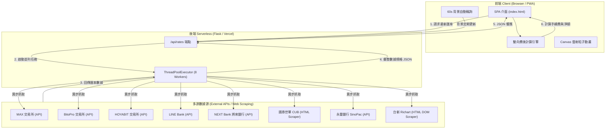

# 💱 台灣交易所與銀行匯率即時比價系統 (TW Exchange Rate Aggregator & Comparison Tool)

[](https://www.python.org/)
[](https://flask.palletsprojects.com/)
[](https://vercel.com/)
[](#license)

> 一站式整合台灣三大加密貨幣交易所（MAX、BitoPro 幣託、HOYA BIT）與各大數位銀行（LINE Bank、將來銀行 NEXT Bank、國泰世華 CUB、永豐大戶 SinoPac DAWHO、台新 Richart）的實時 TWD / USD / USDT / USDC 匯率比價工具。
> 
> 針對「TWD 買入加密貨幣/外幣」與「加密貨幣/外幣 賣回 TWD」提供**雙向費後淨額 (Net Amount) 即時試算**與**動態排行榜**。

---

## 🌟 核心特色 (Key Features)

- ⚡ **8 線程高併發即時抓取**：採用 Python `ThreadPoolExecutor` 異步併發抓取 8 大資料源，將 API 延遲縮短至毫秒等級。
- 🔄 **雙向比價模式 (Buy / Sell Modes)**：
  - **買入模式 (TWD 買入)**：輸入台幣金額，精確計算費後可收到的 USDT / USDC / USD。
  - **賣出模式 (賣回 TWD)**：輸入加密貨幣或美金數量，計算費後可換得的台幣總額。
- 🏆 **費後淨額排行榜 (Live Leaderboard)**：動態排名最佳實得金額，即時標示「最優惠」管道與落差百分比 (% Diff)。
- 🧮 **彈性複合手續費模型**：
  - **交易所**：支援掛單 (Maker)、市價 (Taker) 與自訂 VIP 趴數手續費。
  - **銀行外幣**：支援地區切換（匯至美國 vs 匯至其他國家），自動計算電匯費、郵電費與全額到匯規費。
- 🎨 **賽博龐克微未來感 UI (Cyberpunk Aesthetic)**：
  - Glassmorphism 毛玻璃質感卡片設計。
  - HTML5 Canvas 獨立渲染「網格隨機雷射光束 (Grid Laser Beams)」穿梭動畫。
  - 霓虹極光緩動光暈 (Neon Aurora Orbs)。
- 📱 **PWA 沉浸式體驗**：完整支援 iOS Apple Touch Icon 與 Web App Manifest，可無縫「新增至主畫面」全螢幕操作，具備 iOS safe-area 邊界適應。
- 🔄 **平滑背景輪購 (Smooth Auto-refresh)**：每 1 分鐘自動更新匯率，採用無閃爍 (Flicker-free) DOM 更新，保持使用者輸入狀態連動。

---

## 🛠️ 使用技術與工具 (Tech Stack & Tools)

### **Backend (後端)**
- **Language**: Python 3.11
- **Framework**: Flask 3.1.3
- **Concurrency**: `concurrent.futures.ThreadPoolExecutor` (8 Workers 異步併發)
- **Scraping / Http Client**: `requests`, `urllib3`, `re` (正則表達式解析 HTML/DOM 隱藏欄位)
- **CORS**: `flask-cors` 支援跨網域 API 呼叫

### **Frontend (前端)**
- **Core**: Native Vanilla JavaScript (ES6+ / async & await / Fetch API)
- **Styling**: Vanilla CSS3 (Custom CSS Variables, Flexbox, Grid Layout)
- **Design System**: Glassmorphism (毛玻璃質感)、Cyber Neon 配色、DM Mono & Noto Sans TC 字型
- **Animation Engine**: HTML5 Canvas API (Grid Laser Beams 隨機光束物理粒子動畫)
- **PWA**: Web App Manifest (`manifest.json`) & Apple Mobile Web App Metas

### **Deployment & Cloud Architecture (雲端架構)**
- **Hosting Platform**: Vercel Serverless Functions (`@vercel/python`)
- **Config**: `vercel.json` 一鍵部署路由映射

---

## 🏗️ 系統架構與資料流程 (Architecture & Data Flow)



---

## 💡 技術難點與解決方案 (Technical Challenges & Solutions)

### 1. 多源數據異步併發抓取 (Asynchronous Multi-Source Concurrent Fetching)
- **挑戰**：需同時向 8 個不同交易所與銀行的外部 API/網頁請求數據。若採用傳統同步序列 (Sequential) 請求，累積延遲高達 3~5 秒。
- **解決方案**：在 Flask REST API 層使用 `ThreadPoolExecutor(max_workers=8)`，使 8 個抓取任務同時進行，將整體 API 響應時間大幅縮短至 300~600ms；同時各個抓取函式封裝 Try-Catch 容錯機制，個別來源異常時不影響其他平台運作。

### 2. 非標準 API 與隱藏 DOM 頁面爬蟲 (Non-standard API & Dynamic HTML Parsing)
- **挑戰**：部分銀行（如國泰世華、台新 Richart）未公開開放 API，匯率數據藏在動態 HTML 頁面結構或 `<input id="exchangeRateArray">` 隱藏欄位中，且台新 Richart 欄位字串含有單引號轉義問題。
- **解決方案**：
  - 對國泰世華網頁採用 `select-id` 正則區塊搜尋定位，快速擷取「數位通路優惠匯率」。
  - 對台新 Richart 網頁，撰寫強健的正則表達式提取 DOM `value` 屬性，替換單引號清理字串後進行 JSON 反序列化，實現精確穩定的爬蟲數據抽取。

### 3. 複合式電匯與交易手續費模型 (Multi-Tier Complex Fee Engine)
- **挑戰**：加密貨幣交易採趴數 (0.05% ~ 0.2%) 計算，且分為 Maker/Taker；而傳統銀行外幣涉及電匯費 (固定 TWD/USD)、郵電費、趴數優惠，以及全額到匯規費（如匯往美國與非美國地區差異）。
- **解決方案**：在前端設計彈性 `feeConfig` 動態計費模型，提供使用者一鍵切換「市價/限價/自訂VIP」與「美國/其他地區銀行電匯」，即時連動將電匯固定規費與趴數手續費換算為統一幣別後扣除，計算真正的「費後實得淨額 (Net Amount)」。

### 4. 無閃爍背景輪詢與渲染優化 (Flicker-Free Live DOM Updates)
- **挑戰**：每 60 秒背景自動輪詢匯率時，若重新繪製整體卡片會導致畫面閃爍、滾動位置跑掉與輸入框 Lose Focus。
- **解決方案**：引入 `isFirstLoad` 狀態旗標。首次載入呈現 Skeleton 骨架屏；背景自動輪詢時，僅針對數值 DOM 節點進行微幅平滑更新 (In-place Text Node Update)，保持使用者在輸入金額時完全不干擾操作流暢度。

### 5. 高效能視覺動畫渲染 (High-Performance Canvas & CSS Animation)
- **挑戰**：背景動態霓虹極光與跑馬光束若處理不當，容易引發頻繁的 Layout Reflow 與 GPU/CPU 負載上升。
- **解決方案**：
  - CSS 漸變光暈加上 `will-change: transform` 與獨立圖層提升，並設定 `pointer-events: none` 防止拖慢滑鼠事件。
  - 雷射光束採用 HTML5 Canvas API + `requestAnimationFrame` 獨立繪製粒子更新，實現 60 FPS 流暢光束極致視覺體驗。

---

## 📁 專案目錄結構 (Project Structure)

```
TW-Exchange-Rate/
├── main.py                     # Flask API 伺服器 & 8 線程異步匯率抓取核心邏輯
├── cathay_usd_scraper.py       # 國泰世華銀行美元數位優惠獨立爬蟲示範腳本
├── index.html                  # 前端 SPA 頁面 (介面樣式 / 計算引擎 / Canvas 動畫)
├── requirements.txt            # Python 專案依賴套件套件清單
├── vercel.json                 # Vercel Serverless 一鍵部署設定檔
├── LOGO.jpg                    # 專案預覽標誌圖檔
└── static/
    ├── app_icon.png            # PWA / Web App 高解析度 Icon
    └── manifest.json           # PWA Web Application Manifest 描述檔
```

---

## 🚀 本地開發與啟動說明 (Getting Started)

### 1. 複製專案庫 (Clone Repository)
```bash
git clone https://github.com/stkao891112/TW-Exchange-Rate.git
cd TW-Exchange-Rate
```

### 2. 建立與啟動虛擬環境 (Virtual Environment)
```bash
# Windows
python -m venv venv
.\venv\Scripts\activate

# macOS / Linux
python3 -m venv venv
source venv/bin/activate
```

### 3. 安裝依賴套件 (Install Dependencies)
```bash
pip install -r requirements.txt
```

### 4. 啟動開發伺服器 (Run Flask Server)
```bash
python main.py
```
啟動後於瀏覽器開啟 `http://127.0.0.1:5000` 即可體驗！

---

## ☁️ 雲端部署 (Deployment)

本專案支援一鍵部署至 **Vercel Serverless Platform**。

`vercel.json` 已經配置完成：
```json
{
  "builds": [
    { "src": "main.py", "use": "@vercel/python" }
  ],
  "routes": [
    { "src": "/(.*)", "dest": "main.py" }
  ],
  "env": {
    "PYTHON_VERSION": "3.11"
  }
}
```

### 部署步驟：
1. 將專案推載至 GitHub。
2. 在 Vercel 官網點擊 **Import Project**，選擇本專案儲存庫。
3. 框架選擇 **Other**，點選 **Deploy** 即可在一分鐘內完成全 Serverless 部署！

---

## 📱 PWA / 手機「新增至主畫面」支援

本專案支援原生級 PWA (Progressive Web App) 體驗：
- **iPhone / iPad (iOS)**：在 Safari 開啟網頁點擊「分享」按鈕 ➔ 選擇「加入主畫面 (Add to Home Screen)」。
- **Android**：在 Chrome 開啟網頁點擊選單 ➔ 選擇「安裝應用程式 / 加入主畫面」。

桌面上將產生專屬 App 圖示，開啟後即可無網址列全螢幕運行。

---

## 📄 聲明與授權 (Disclaimer & License)

- **資料聲明**：本系統所顯示之匯率數據均擷取自各交易所與銀行之公開 API 與網站，僅供參考，實際交易匯率與手續費請以各機構官方最終公告為準。
- **License**: 本專案基於 [MIT License](LICENSE) 條款開源發布。